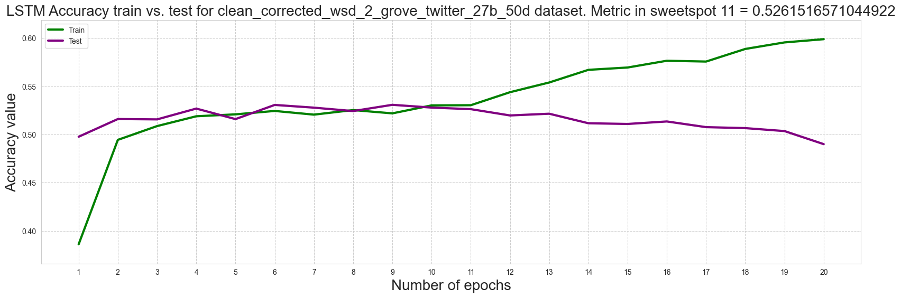
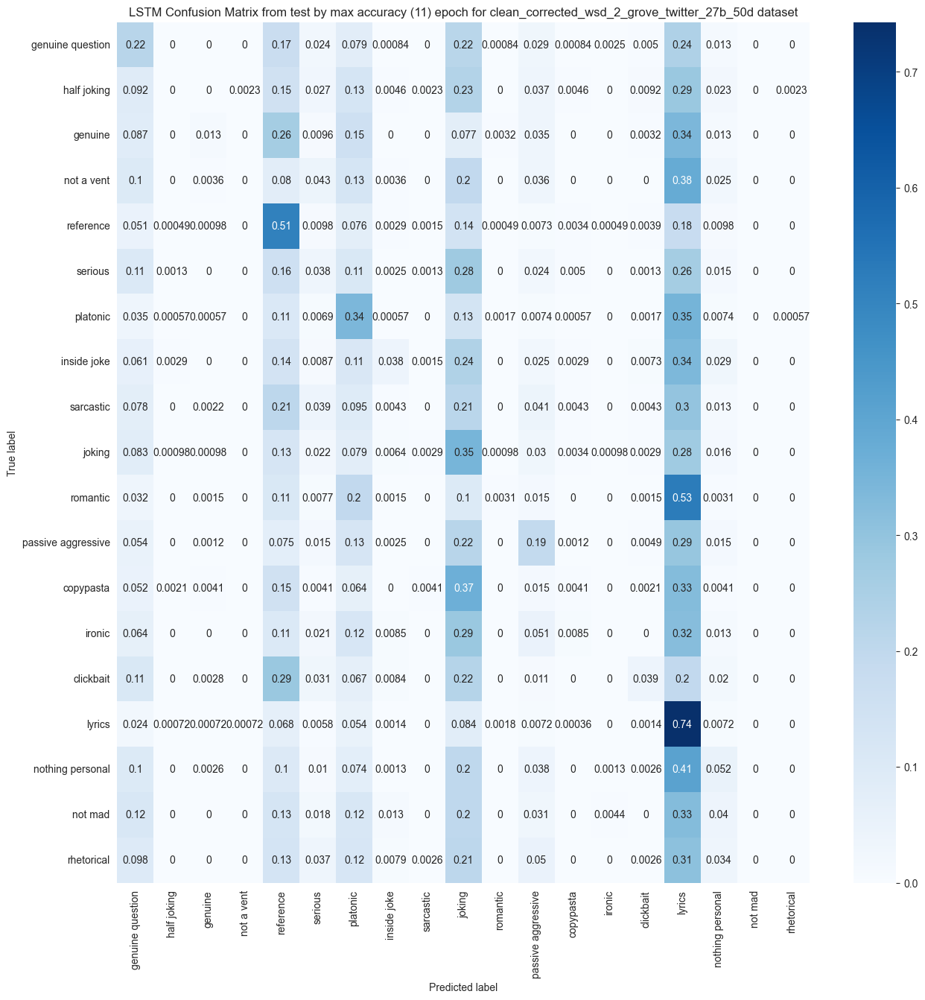
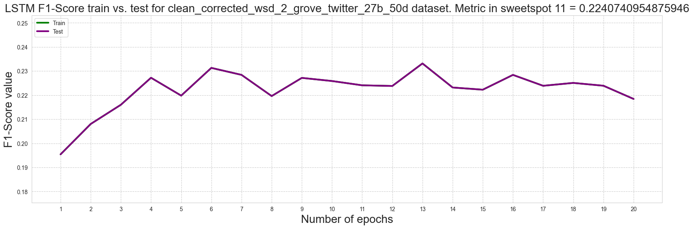
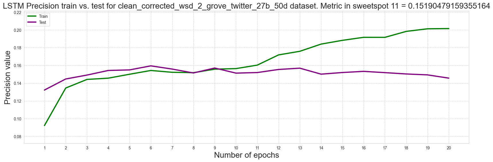
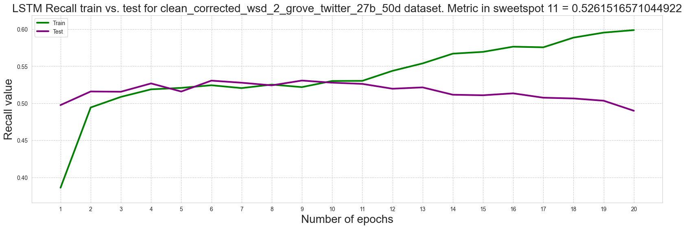

# Tone tags text classifier

## Current results

* All collected and processed datasets are in their respective archives in the following folder:
```
.\datasets
```
archiving was implemented using WinRAR

* [Project presentation](https://docs.google.com/presentation/d/1kJcXnDjRYPxNKGzpxprdzc_KKSjkLR9smEgEMdHbUlY)

* [Project report](.\\docs_and_other_files\\project_report.pdf)

### Metrics

The code to retrieve the metrics is provided in the file:
```
.\notebooks\check_lstm_results.ipynb
```
Here are the best results, the results for the other datasets for the lstm model can be seen in the above file.
All metrics are presented with weighted and top k 3 parameters.

#### LSTM Accuracy (weighted, top_k=3)



#### LSTM Confusion matrix in 11 epoch (weighted, top_k=3)



#### LSTM F1 Score (weighted, top_k=3)



#### LSTM Precision (weighted, top_k=3)



#### LSTM Recall (weighted, top_k=3)



## How to try to use model from this repository

* to use this project you need to unpack model to 
```
.\results\models\lstm_model.pt
```

The archived model is located in the folder:
```
.\results\models\lstm_model.zip
```

* The project uses glove vectors, downloading it manually may be faster than the code will do, so you can download glove.twitter.27B.50d from here manually (optional): [Link to GloVe](https://nlp.stanford.edu/projects/glove/)

* to host this app download model in directory and use this command:
```shell
python -m streamlit run streamlit_app.py
```